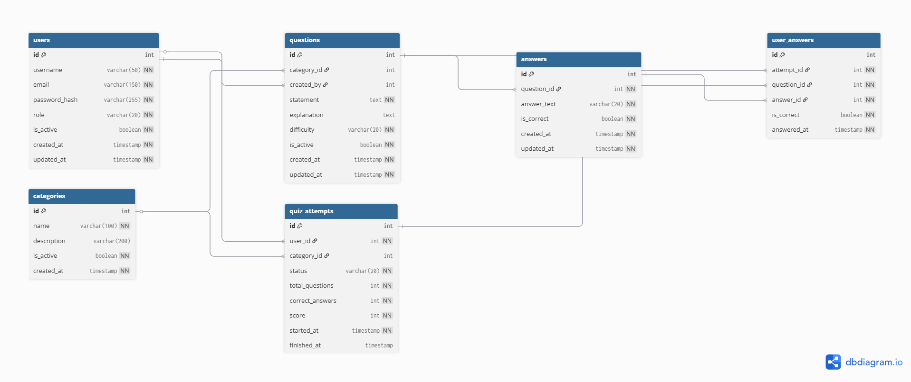
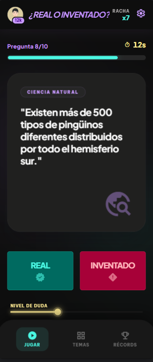

## Modelo y pantallas propuestas

Este documento resume la propuesta de modelo de datos y la interpretación general de las pantallas compartidas para **¿Real o Inventado?**.

## Aclaración importante sobre el alcance

Para la entrega del lunes, este documento debe leerse con una lógica de **MVP**:

- el modelo prioriza lo necesario para que el juego funcione;
- las pantallas son referenciales;
- no todos los elementos visuales observados forman parte del alcance comprometido;
- el objetivo no es construir una plataforma completa, sino una versión funcional y coherente.

## Qué se espera construir para la entrega

La propuesta de datos se enfoca en soportar:

- registro e inicio de sesión;
- preguntas precargadas;
- respuestas guardadas en base de datos;
- clasificación de preguntas por categoría;
- partidas individuales;
- respuestas del usuario;
- puntaje final por partida;
- consulta básica de resultados;
- CRUD de usuarios;
- CRUD de preguntas;
- CRUD de respuestas;
- gestión básica de puntajes.

## Modelo de base de datos recomendado

Para este proyecto, el modelo más conveniente es uno simplificado y alineado con la mecánica real del juego. Como la dinámica sigue siendo binaria, la tabla de respuestas debe mantenerse mínima y controlada.

### Diagrama de referencia

### Entidades recomendadas

#### `users`

Guarda la información básica del usuario:

- nombre de usuario;
- correo;
- contraseña cifrada;
- estado activo;
- rol simple si se requiere distinguir entre jugador y administrador.

#### `categories`

Permite agrupar preguntas por tema.

#### `questions`

Representa cada afirmación del juego. Esta entidad debe incluir:

- texto de la afirmación;
- categoría;
- dificultad opcional;
- estado activo.

#### `answers`

Permite cumplir con el requerimiento de guardar respuestas en base de datos y exponer un CRUD para ellas.

Para mantener el proyecto simple:

- cada pregunta puede tener solo dos respuestas;
- las respuestas esperadas son `Real` e `Inventado`;
- una de ellas se marca como correcta.

Así se conserva la mecánica del juego sin convertirlo en un quiz de opciones múltiples más complejo.

#### `quiz_attempts`

Representa cada partida del usuario:

- fecha de inicio;
- fecha de finalización;
- puntaje final;
- total de preguntas;
- total de aciertos.

#### `user_answers`

Registra la respuesta dada por el jugador en una partida:

- qué partida está contestando;
- qué pregunta respondió;
- qué respuesta eligió el usuario;
- si acertó;
- cuándo respondió.

## Entidades que conviene evitar en esta entrega

Para un proyecto de dos días, estas tablas agregan complejidad y no son indispensables:

### `sessions`

Solo es necesaria si realmente van a persistir sesiones o refresh tokens en base de datos. Para un MVP con autenticación simple, puede omitirse.

### `score_history`

Puede omitirse porque el historial de puntajes puede derivarse directamente de `quiz_attempts`. Guardar ambas cosas desde el inicio duplicaría información.

## Relación general recomendada

- Un usuario puede realizar muchas partidas.
- Una categoría puede tener muchas preguntas.
- Una pregunta pertenece a una categoría.
- Una pregunta puede tener varias respuestas, aunque en este proyecto se recomienda limitarla a dos.
- Una partida pertenece a un usuario.
- Una partida tiene muchas respuestas del usuario.
- Cada respuesta del usuario corresponde a una sola pregunta dentro de una sola partida.

## Propuesta funcional de las pantallas

Las imágenes compartidas sirven como guía visual, pero no deben interpretarse como requisitos exactos.

### 1. Pantalla de login

#### Interpretación útil para el proyecto

- debe permitir iniciar sesión;
- puede incluir acceso al registro;
- los accesos sociales deben verse solo como propuesta visual, no como funcionalidad obligatoria.

### 2. Pantalla de juego

#### Interpretación útil para el proyecto

- mostrar una afirmación;
- permitir contestar **Real** o **Inventado**;
- reflejar progreso de la ronda si alcanza el tiempo;
- terminar la partida con cálculo de puntaje.

Elementos como racha, nivel de duda, navegación completa o temporizador avanzado pueden considerarse opcionales si no afectan la entrega mínima funcional.

## Coherencia entre modelo y producto

La versión más coherente para este proyecto corto es:

- autenticación básica;
- preguntas binarias;
- respuestas almacenadas explícitamente;
- una partida por intento;
- registro de respuestas;
- puntaje final;
- historial básico derivado de las partidas.

Ese enfoque reduce riesgo, evita sobreingeniería y deja una base clara para crecer después.

## Conclusión

La mejor propuesta para esta entrega no es el modelo más grande, sino el más claro y ejecutable. Para **¿Real o Inventado?**, el diseño ideal es uno simple, centrado en usuarios, categorías, preguntas, respuestas, partidas y respuestas del usuario, dejando fuera tablas que responden a futuras versiones más complejas del sistema.
